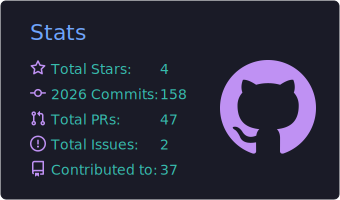
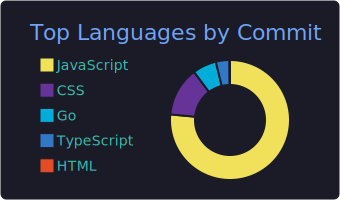
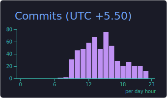

 

  

  

  <table style="border: none; border-collapse: collapse; margin: 20px 0;">
    <tr>
      <td width="320" align="center" style="border: none; vertical-align: middle;">
        
      </td>
      <td width="60" style="border: none;"></td>
      <td align="left" style="border: none; vertical-align: middle;">
        

          
        

        

          
        

         
        

          <samp>
             &nbsp;<b>Residing in:</b> India 
             &nbsp;<b>Current Focus:</b> AI-Driven SaaS & Scalable Systems
          </samp>
        

      </td>
    </tr>
  </table>
  
<i> "Crafting experiences that bridge the gap between imagination and reality."</i>

 

  

    <code>❯ Building scalable real-time applications with modern tech stacks</code> 
    <code>❯ Specializing in Generative AI, Cloud, and high-performance WebSockets</code>
  

 

##  **Technical Arsenal**

<table style="border: none; width: 100%; max-width: 900px;">
  <tr>
    <td align="center" style="border: none; padding: 15px;">
      <b>Frontend</b> 
            
    </td>
    <td align="center" style="border: none; padding: 15px;">
      <b>Backend</b> 
          
    </td>
  </tr>
  <tr>
    <td align="center" style="border: none; padding: 15px;">
      <b>Languages</b> 
            
    </td>
    <td align="center" style="border: none; padding: 15px;">
      <b>Database & Cloud</b> 
            
    </td>
  </tr>
</table>

 

  <h2> GitHub Insights</h2>
  

    
  

  <table style="border: none; border-collapse: collapse;">
    <tr>
      <td style="border: none;">
        
      </td>
      <td style="border: none;">
        
      </td>
    </tr>
  </table>
   
  <table style="border: none; border-collapse: collapse;">
    <tr>
      <td style="border: none; padding: 5px;">
        
      </td>
      <td style="border: none; padding: 5px;">
        
      </td>
    </tr>
  </table>

 

  

