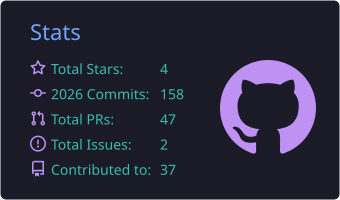
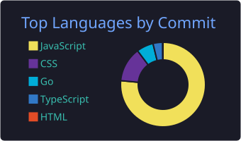
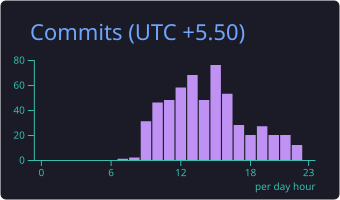

 

  

  

  <table style="border: none; border-collapse: collapse; margin: 20px 0;">
    <tr>
      <td width="320" align="center" style="border: none; vertical-align: middle;">
        
      </td>
      <td width="60" style="border: none;"></td>
      <td align="left" style="border: none; vertical-align: middle;">
        

          
        

        

          
        

         
        

          <samp>
             &nbsp;<b>Base:</b> India 
             &nbsp;<b>Current Stack:</b> Multi-Runtime Microservices
          </samp>
        

      </td>
    </tr>
  </table>
  
<i> "Building across paradigms, from bare-metal logic to cloud-native scale."</i>

 

##  **System Engine Layers**

<table style="border: none; width: 100%; max-width: 950px;">
  <tr>
    <td align="left" style="border: none; padding: 15px; background: rgba(122, 162, 247, 0.05); border-radius: 12px; margin: 5px;">
       <b>High Performance Core</b> 
      
Reliable concurrency & system internals

          
    </td>
    <td width="20" style="border: none;"></td>
    <td align="left" style="border: none; padding: 15px; background: rgba(158, 238, 106, 0.05); border-radius: 12px; margin: 5px;">
       <b>Reactive Logic Lab</b> 
      
Modern orchestration & real-time UI

          
    </td>
  </tr>
  <tr height="10"></tr>
  <tr>
    <td align="left" style="border: none; padding: 15px; background: rgba(187, 154, 247, 0.05); border-radius: 12px; margin: 5px;">
       <b>Distributed Infrastructure</b> 
      
Scalable persistence & orchestration

          
    </td>
    <td width="20" style="border: none;"></td>
    <td align="left" style="border: none; padding: 15px; background: rgba(247, 118, 142, 0.05); border-radius: 12px; margin: 5px;">
       <b>AI & GenAI Integration</b> 
      
Neural logic & LLM orchestration

         
    </td>
  </tr>
</table>

 

  <h2> **Logical Paradigms**</h2>
  
<i>One problem, multiple solutions.</i>

  
  <table style="border: none; width: 100%; max-width: 950px;">
    <tr>
      <td width="33%" style="border: none; padding: 5px;">
        

           <b>Go (Concurrency)</b>
        

        <pre align="left" style="background: #1a1b26; padding: 10px; border-radius: 8px; border: 1px solid #7aa2f7;">
<code style="color: #7aa2f7; font-size: 11px;">
go func() {
  results <- process(data)
}()
</code></pre>
      </td>
      <td width="33%" style="border: none; padding: 5px;">
        

           <b>TS (Type Safety)</b>
        

        <pre align="left" style="background: #1a1b26; padding: 10px; border-radius: 8px; border: 1px solid #9ece6a;">
<code style="color: #9ece6a; font-size: 11px;">
type Engine<T> = {
  process: (d: T) => void
}
</code></pre>
      </td>
      <td width="33%" style="border: none; padding: 5px;">
        

           <b>C++ (Performance)</b>
        

        <pre align="left" style="background: #1a1b26; padding: 10px; border-radius: 8px; border: 1px solid #f7768e;">
<code style="color: #f7768e; font-size: 11px;">
auto start = now();
engine.execute();
log(now() - start);
</code></pre>
      </td>
    </tr>
  </table>

 

  <h2> **System Analytics**</h2>
  

    
  

  
  <table style="border: none; border-collapse: collapse;">
    <tr>
      <td style="border: none; padding: 10px;">
        
      </td>
      <td style="border: none; padding: 10px;">
        
      </td>
    </tr>
    <tr>
      <td style="border: none; padding: 10px;">
        
      </td>
      <td style="border: none; padding: 10px;">
        
      </td>
    </tr>
  </table>

 

  

  <samp><b>"Code is poetry, but systems are the stage."</b></samp> 
  <i>Crafted with precision & logic by Madhav</i>

 

  

