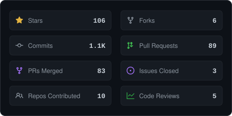

<table width="100%">
<tr>
<td width="65%" valign="top" align="center">

  

</td>
<td width="35%" valign="top" align="center">

</td>
</tr>
<tr>
<td colspan="2" align="center">

  
  
  
  

</td>
</tr>
</table>
